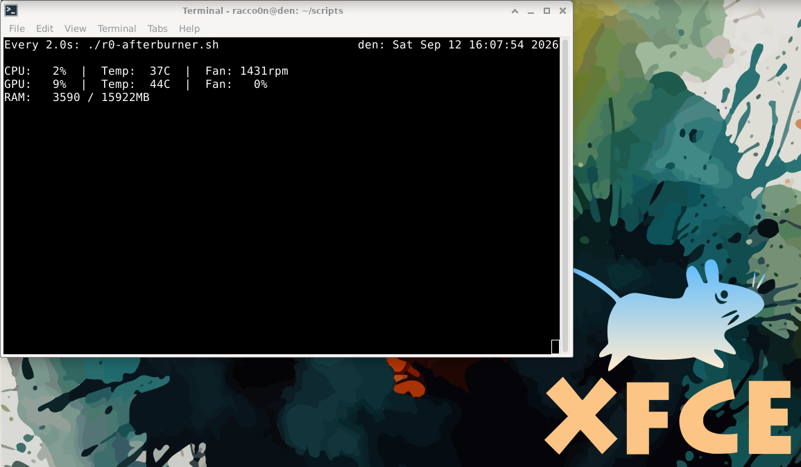

# r0-afterburner

r0-afterburner is simple monitoring tool for CPU / GPU / RAM for linux that 
prints the results stright to the terminal for max simplicity and performance.



## Requirements

- `lm-sensors` - CPU temp and fan speed (`sudo apt install lm-sensors`, then run `sudo sensors-detect`)
- `nvidia-smi` - comes with the NVIDIA driver, used for GPU stats
- `bc` - used for the CPU usage calculation

## Usage

```bash
chmod +x r0-afterburner.sh
./r0-afterburner.sh
```
